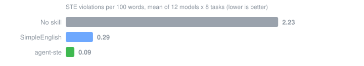
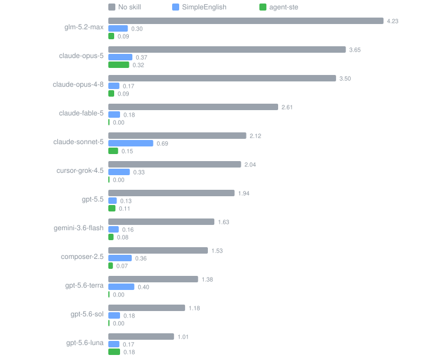

<p align="center">
  <strong>agent-ste — make your agent write text that survives one read</strong>
</p>

<p align="center">
<a href="https://agentskills.io">An Agent Skill</a> <span>that makes LLMs write in</span> <a href="https://www.asd-ste100.org/">ASD-STE100 Simplified Technical English</a><span> — the controlled language that aerospace built so a tired mechanic cannot misread an instruction.</span>
</p>

<p align="center">
  <a href="evals/results/RESULTS.md"></a>
  <a href="evals/results/RESULTS.md"></a>
  <a href="https://agentskills.io"></a>
  <a href="LICENSE"></a>
</p>

---

Your agent writes long sentences, hedges with `should`, and rotates synonyms. A reader who cannot ask questions then guesses. Sometimes the reader is a tired human. Sometimes the reader is another LLM that parses a tool description or an error message. STE removes the guessing. This skill enforces STE with one addition the other skills lack: a mandatory final gate of ten search-and-fix passes before the agent delivers.

## Benchmark results

We benchmarked agent-ste against [SimpleEnglish](https://github.com/AminBlg/SimpleEnglish), the most popular STE skill, on its own open benchmark. The measurement layer is theirs, unmodified: the same 8 writing tasks, the same prompt wrapper, and a byte-identical copy of their linter. All three conditions ran fresh on one harness, across 12 models from 5 model families.

**Result: agent-ste removed 95.5% of measured STE violations. SimpleEnglish removed 85.1% on the identical run.**



agent-ste scored best on 11 of the 12 models and hit zero violations on 4 of them:



<details>
<summary>The same numbers as a table</summary>

| Model | No skill | SimpleEnglish | agent-ste |
|---|---|---|---|
| claude-opus-4-8 | 3.50 | 0.17 | **0.09** |
| claude-sonnet-5 | 2.12 | 0.69 | **0.15** |
| claude-opus-5 | 3.65 | 0.37 | **0.32** |
| claude-fable-5 | 2.61 | 0.18 | **0.00** |
| gpt-5.6-sol | 1.18 | 0.18 | **0.00** |
| gpt-5.6-terra | 1.38 | 0.40 | **0.00** |
| gpt-5.6-luna | 1.01 | **0.17** | 0.18 |
| gpt-5.5 | 1.94 | 0.13 | **0.11** |
| glm-5.2-max | 4.23 | 0.30 | **0.09** |
| composer-2.5 | 1.53 | 0.36 | **0.07** |
| gemini-3.6-flash | 1.63 | 0.16 | **0.08** |
| cursor-grok-4.5 | 2.04 | 0.33 | **0.00** |

Violations per 100 words, mean of 8 tasks, lower is better.

</details>

The linter measures rule-following. For quality, a blind pairwise judge scored the two skills' outputs with no labels, in both orders:


Output length stayed comparable across all three conditions, so the skill does not win because it writes less. As of August 2026, agent-ste holds the top score on this open benchmark. The charts regenerate from the raw data with one command: `python3 evals/make_charts.py`.

The full method, the caveats, and the raw JSON for all 288 generations and 95 judged pairs live in [`evals/results/`](evals/results/RESULTS.md). Caveats: one generation per cell, a Claude judge scored partly-Claude output, and both skills coach the rules that the linter counts. To reproduce the run, read [Reproduce](#reproduce).

## Before and after

One benchmark task: write a README introduction for a CLI tool. Model: `gemini-3.6-flash`, no skill:

```text
**sqlpipe** is a lightweight, high-performance CLI tool designed to seamlessly
stream PostgreSQL tables into Amazon S3 as optimized Apache Parquet files.
Built for modern data engineering and analytics workflows, ...
```

The same model and the same task, with agent-ste:

```text
`sqlpipe` is a command-line tool that exports data from PostgreSQL databases
to Amazon S3. The tool reads tables from your database and writes the data to
S3 as Apache Parquet files. ... If a network error occurs during a transfer,
`sqlpipe` retries the failed part automatically.
```

The skill deleted the adjectives that carry no facts and moved each condition to the front of its sentence. More unedited outputs, with violation counts and the exact source files, are in [`docs/EXAMPLES.md`](docs/EXAMPLES.md).

CI lints the prose of this page with the same benchmark linter and fails above zero violations. The linter parses prose, not markdown layout, so table rows and badge lines stay out of the pass.

## Install

```bash
npx skills add abryfs/agent-ste
```

The [skills CLI](https://github.com/vercel-labs/skills) detects your agents (Claude Code, Cursor, Codex, Copilot, Gemini CLI, and more) and installs for the ones you pick. To try it without an install:

```bash
npx skills use abryfs/agent-ste@agent-ste
```

Claude Code users can install the repo as a plugin instead:

```
/plugin marketplace add abryfs/agent-ste
/plugin install agent-ste@agent-ste
```

The plugin route gives you update management inside Claude Code. The two routes install the same skill file. Pick one.

When your tool has no skill support, paste [`prompts/system-prompt.md`](prompts/system-prompt.md) into your system prompt, AGENTS.md, or custom instructions. A version of about 60 tokens is included for tight budgets.

Then ask for any technical writing, or say: "rewrite this with agent-ste".

## What the skill does

The skill classifies each passage as procedural or descriptive, locks one word per concept, and applies the STE writing rules. Before the agent delivers, it must run ten explicit searches on its own draft:

1. Every contraction.
2. `should`, `would`, `may`, `might`, `could`.
3. Perfect tenses, such as `has been`.
4. A comma followed by an "-ing" word.
5. Every semicolon.
6. Latin abbreviations.
7. Filler words with no fact in them.
8. Mid-sentence conditions — every `if` moves to the front.
9. Synonyms of the chosen words.
10. Sentence length over the 20/25-word limits.

Every hit is a defect. The agent fixes and searches again until the draft is clean. A rule catalog states what good looks like. A search list states what to do. Models follow the second one better, and the benchmark gap above is the measured difference.

The skill also targets the text that only machines read: tool descriptions, error messages, system prompts, and inter-agent messages. A model reads `should` as optional. A prompt is a procedure for a reader that cannot ask questions. Full details in [`skills/agent-ste/SKILL.md`](skills/agent-ste/SKILL.md).

## Alternatives

Two other projects cover this ground. Both are good. Pick what fits. A full feature and benchmark comparison is in [`docs/COMPARISON.md`](docs/COMPARISON.md).

- [SimpleEnglish](https://github.com/AminBlg/SimpleEnglish) — the most popular STE skill, with an output style, a plugin marketplace, and the benchmark harness this repo builds on. Pick it for the output style.
- [asd-ste100-skill](https://github.com/danyuchn/asd-ste100-skill) — a single-file rewriter with a sharp framing: STE as a fix for agent-to-agent ambiguity. Pick it for a minimal Claude-Code-only setup.
- The [official standard](https://www.asd-ste100.org/) — a free download from ASD. When you need the real dictionary and word-level rulings, use the standard itself. No skill replaces it, this one included.

## Reproduce

The benchmark needs a logged-in CLI (Claude Code or Cursor) and a clone of the upstream skill for the comparison condition:

```bash
git clone https://github.com/abryfs/agent-ste && cd agent-ste
git clone https://github.com/AminBlg/SimpleEnglish ../SimpleEnglish
python3 evals/ste_lint.py --self-test
python3 evals/run_bench.py --smoke     # 1 model, 1 task, 3 conditions
python3 evals/run_bench.py             # full matrix
python3 evals/run_bench.py --judge     # blind pairwise judge pass
```

`ste_lint.py` and `scenarios.json` are byte-identical copies from SimpleEnglish. Diff them against upstream to confirm that the measurement layer was not touched. Set `BENCH_HARNESS=cursor` and `BENCH_MODELS` to change the harness and the model list.

## FAQ

**Does this make output STE-certified?** No. ASD certifies no tool. The skill applies the structural rules and paraphrased vocabulary patterns. Word-level rulings live in the official standard, a free download.

**Does the dictionary block technical words?** No. STE allows technical names and technical verbs from your domain. The rules govern the connective English around your jargon, not the jargon.

**Why not prompt "write clearly"?** "Clearly" is an opinion. "No sentence over 20 words" is a test that the writer can run. The final gate turns every rule into a search.

**What does the skill cost in tokens?** At rest, your agent loads only the description: about 100 tokens. On activation, the full skill loads: about 2,400 tokens, half the size of the most popular STE skill. The prompt fallbacks cost about 230 and 60 tokens.

**Will my docs sound flat?** Yes, and that is the point. Keep your voice for your blog. Do not apply STE to marketing text.

## Credits

The benchmark harness, the linter, and the task set come from [SimpleEnglish](https://github.com/AminBlg/SimpleEnglish) (MIT), and this skill stands on that work. The agent-facing framing follows [asd-ste100-skill](https://github.com/danyuchn/asd-ste100-skill) (MIT). This project is unofficial. It is not affiliated with or endorsed by ASD or STEMG. It reproduces zero specification text and zero dictionary content. ASD-STE100 is a registered trademark of ASD.

## License

MIT — see [LICENSE](LICENSE).
